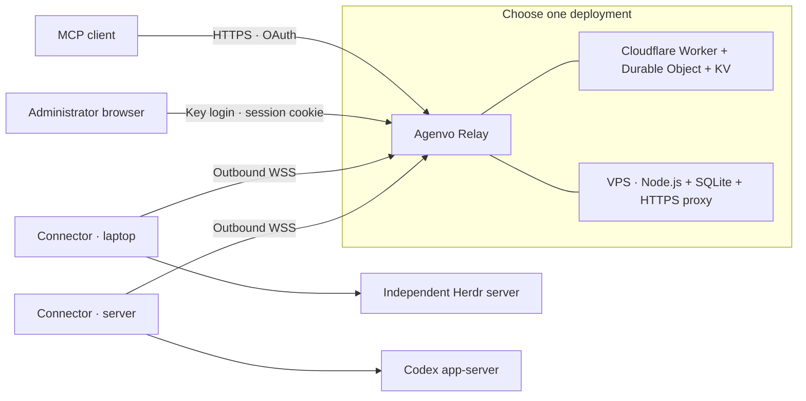

# Agenvo

[简体中文](README.zh-CN.md)

Agenvo gives MCP clients a common interface to services that manage coding agents on your own computers. A small, always-reachable relay forwards requests to outbound device connections. Tasks run on the device, in native Herdr or Codex environments.

**Status:** early release, tested with Herdr 0.9.3 and Codex CLI 0.160.1.



Three MCP tools let clients discover instances, create and manage Threads, send input, observe output, and interrupt, resume or archive where supported. Shared services include threads created by other clients.

Each deployment has one owner. Authorized clients can access all approved instances, including later approvals. Codex uses full access without execution approval prompts. Herdr runs independently; the Connector attaches to it. Read the [security boundaries](SECURITY.md) before sharing a service.

## Start from source

Install Node.js **24.13 or newer**, npm, and the runtime you intend to share. macOS and Linux are supported for the Connector; Linux is the intended VPS host.

```sh
git clone https://github.com/Xuanwo/agenvo.git
cd agenvo
npm ci
npm run build
node dist/cli.js --help
```

Use `node /absolute/path/to/agenvo/dist/cli.js` in place of `agenvo` in the guides, or run `npm link` to install the local CLI.

1. Deploy a relay using [Cloudflare](docs/deployment-cloudflare.md) or a [single VPS](docs/deployment-vps.md).
2. [Configure and pair a Connector](docs/usage.md) on each computer.
3. Add `https://YOUR_RELAY/mcp` to an MCP client, then approve its OAuth request.

Cloudflare uses a Worker with hibernating device connections; it needs no always-on container. A VPS runs a persistent Node.js process with SQLite. Tasks execute on the devices.

## Documentation

- [Connect devices](docs/usage.md) · [Connect ChatGPT](docs/chatgpt.md)
- [Manage Agent threads](docs/management.md)
- [Cloudflare deployment](docs/deployment-cloudflare.md) · [VPS deployment](docs/deployment-vps.md)
- [Security](SECURITY.md) · [Upgrade older installations](docs/migration.md)
- [Contributing and tests](CONTRIBUTING.md) · [Architecture (Chinese)](docs/design/architecture.zh-CN.md) · [Management design (Chinese)](docs/design/agent-management.zh-CN.md)

## License

[Apache-2.0](LICENSE).
