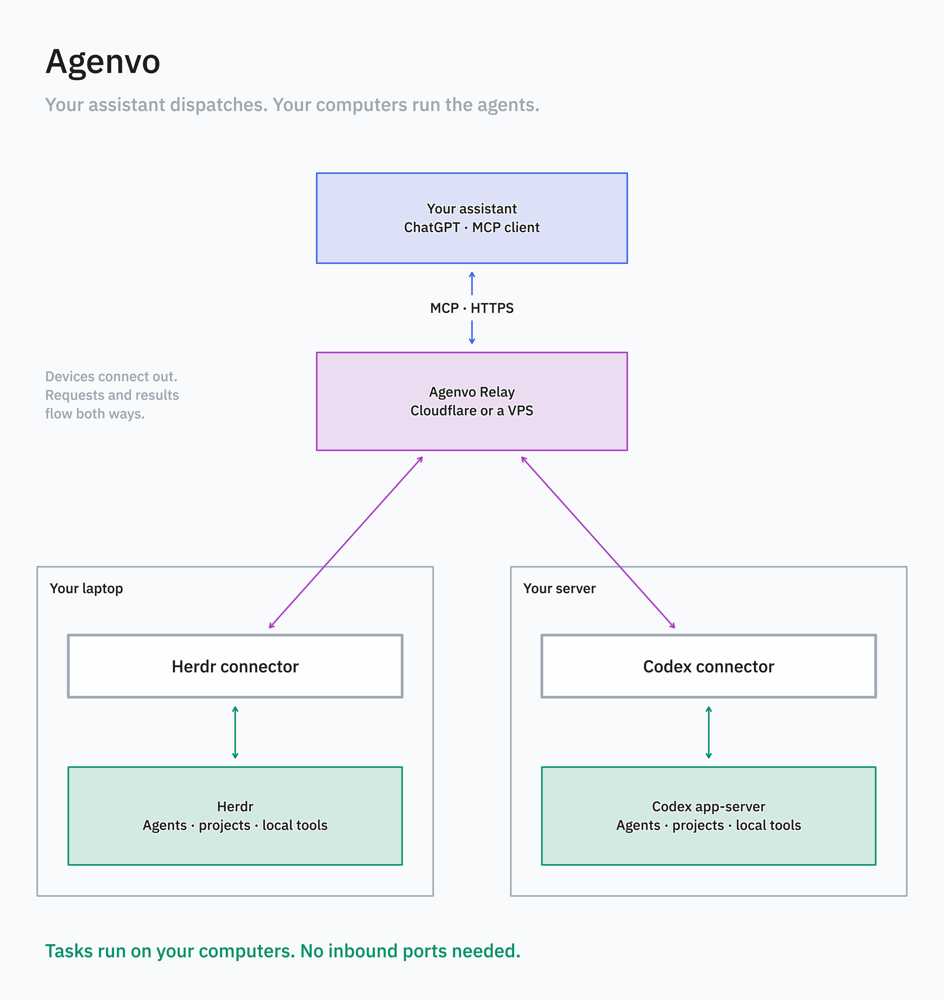

# Agenvo

[简体中文](README.zh-CN.md)

Let your AI assistant coordinate coding agents on your own computers.

Ask ChatGPT on your phone to check on Codex running on your server, or have an agent in Herdr on your laptop fix a failing test. Agenvo connects your assistant to **Herdr** and **Codex app-server** through MCP. You describe the goal; your assistant decides how to move the work forward.

You host the relay yourself on Cloudflare or a single VPS.

## If you are an AI agent

- Set up Agenvo for the user and connect their computers and assistant: [Installation](docs/installation.md).
- Troubleshoot connection or authorization failures: [Diagnostics](docs/usage.md#revoke-and-diagnose).
- Manage agent work through an existing MCP connection: [Agent management](docs/management.md).
- Understand or change Agenvo's architecture: [Architecture design (Chinese)](design/architecture.zh-CN.md).

## License

[Apache-2.0](LICENSE).
