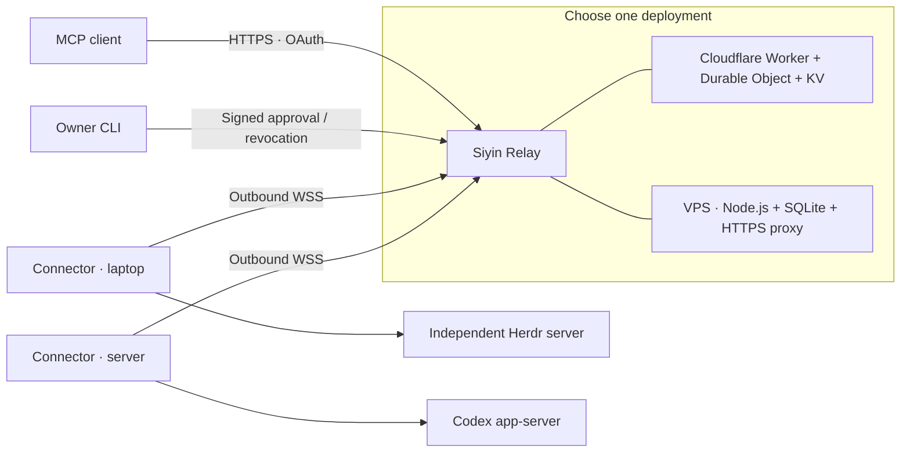

# Siyin · 嗣音

[简体中文](README.zh-CN.md)

Siyin connects an MCP client to coding runtimes on your own computers. A small, always-reachable relay forwards requests to outbound device connections. Tasks run on the device, in native Herdr or Codex environments.

**Status:** early release, single owner per deployment. Herdr 0.9.3 and Codex CLI 0.160.1 are the tested adapter versions. Review the [security boundaries](SECURITY.md) before sharing a runtime.



## What it does

- Shares entire approved runtime instances, with discovery and native method schemas.
- Exposes three MCP tools: `instances_list`, `instance_describe`, and `runtime_call`.
- Pairs devices using a fingerprint confirmed by the owner; new or changed instance scopes need approval.
- Preserves native task IDs and execution outcomes. An accepted call is not a completed task.
- Reconnects devices without replaying writes. An uncertain result must be checked against native state.
- Attaches to independently running Herdr servers. The Connector never starts or stops Herdr sessions.

Siyin is a relay, not a task scheduler or a shell sandbox. A permitted Herdr instance can execute commands as its local user. All authorized MCP clients can reach all approved instances in that deployment, including instances approved later.

## Start from source

Install Node.js **24.13 or newer**, npm, and the runtime you intend to share. macOS and Linux are supported for the Connector; Linux is the intended VPS host.

```sh
npm ci
npm run build
node dist/cli.js --help
```

Use `node /absolute/path/to/siyin/dist/cli.js` in place of `siyin` in the guides, or run `npm link` to install the local CLI. There is no published npm package required by these instructions.

1. Deploy a relay using [Cloudflare](docs/deployment-cloudflare.md) or a [single VPS](docs/deployment-vps.md).
2. [Configure and pair a Connector](docs/usage.md) on each computer.
3. Add `https://YOUR_RELAY/mcp` to an MCP client, then approve its OAuth request.

| Deployment | Persistent state | Owner administration | Operations |
| --- | --- | --- | --- |
| Cloudflare | Durable Object SQLite, OAuth KV | Signed CLI; optional Access-protected browser UI | Managed Worker, hibernating device sockets |
| Single VPS | SQLite on a persistent local disk | Signed CLI | One Node process, HTTPS proxy, backups |

The VPS process stays running. Cloudflare does not require an always-on container. Neither target runs the coding agent in the relay.

## Documentation

- [Usage](docs/usage.md) · [中文](docs/usage.zh-CN.md)
- [VPS deployment](docs/deployment-vps.md) · [中文](docs/deployment-vps.zh-CN.md)
- [Cloudflare deployment](docs/deployment-cloudflare.md) · [中文](docs/deployment-cloudflare.zh-CN.md)
- [Security](SECURITY.md) · [中文](SECURITY.zh-CN.md)
- [Contributing and tests](CONTRIBUTING.md) · [中文](CONTRIBUTING.zh-CN.md)
- [Architecture and protocol design / 架构与协议设计](docs/design/architecture.zh-CN.md)

## License

[Apache-2.0](LICENSE).
