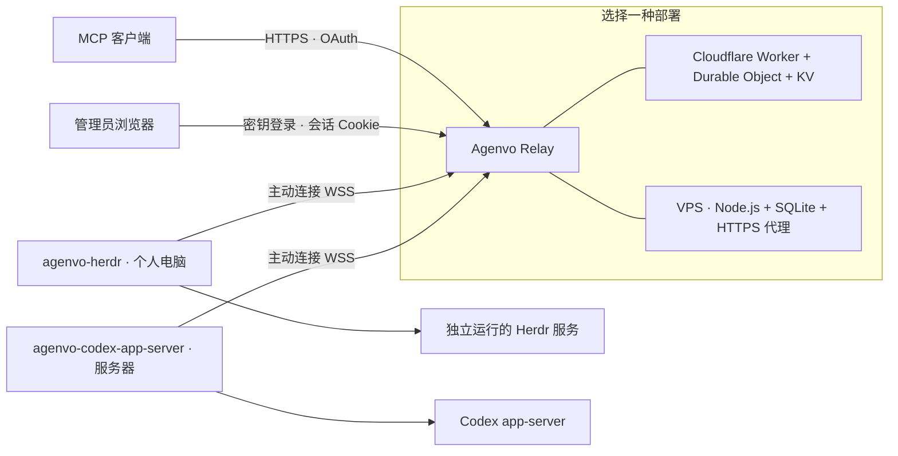

# Agenvo

[English](README.md)

Agenvo 为 MCP 客户端提供统一接口，管理你自己电脑上的 Agent 管理服务。持续可访问的 Relay 将请求转发到设备主动建立的连接，任务在设备上的原生 Herdr 或 Codex 环境中执行。

**状态：**早期版本，已验证 Herdr 0.9.3 和 Codex CLI 0.160.1。



通过三个 MCP 工具发现实例、创建和管理 Thread、发送输入、观察输出，并按后端能力中断、恢复或归档会话。共享范围包含其他客户端创建的会话。

每个部署只支持一个所有者；所有获准客户端均可访问全部已批准实例，包括之后批准的实例。Codex 使用 full access 并关闭执行审批。Herdr 独立运行，Connector 只连接它。共享前请阅读[安全边界](SECURITY.zh-CN.md)。

## 从源码开始

安装 Node.js **24.13 或更新版本**、npm，以及需要共享的运行时。Connector 支持 macOS 和 Linux；VPS 部署面向 Linux。

```sh
git clone https://github.com/Xuanwo/agenvo.git
cd agenvo
npm ci
npm run build
node apps/herdr/dist/cli.js --help
node apps/codex-app-server/dist/cli.js --help
node apps/server/dist/cli.js --help
```

三个发行包分别是 `@agenvo/herdr`、`@agenvo/codex-app-server` 和 `@agenvo/server`，命令分别为 `agenvo-herdr`、`agenvo-codex-app-server` 和 `agenvo-server`。源码构建后可使用上面的 Node 入口，或在对应 `apps/` 目录运行 `npm link`。Cloudflare 从仓库通过 Wrangler 部署。

1. 按 [Cloudflare 部署](docs/deployment-cloudflare.zh-CN.md)或[单 VPS 部署](docs/deployment-vps.zh-CN.md)建立 Relay。
2. 在每台电脑上[配置并配对 Connector](docs/usage.zh-CN.md)。
3. 在 MCP 客户端中添加 `https://YOUR_RELAY/mcp`，再批准 OAuth 请求。

Cloudflare 使用 Worker 和可休眠的设备连接，无需常驻容器；VPS 使用常驻 Node.js 进程与 SQLite。任务始终在设备上执行。

## 文档

- [连接设备](docs/usage.zh-CN.md) · [连接 ChatGPT](docs/chatgpt.zh-CN.md)
- [管理 Agent 会话](docs/management.zh-CN.md)
- [Cloudflare 部署](docs/deployment-cloudflare.zh-CN.md) · [VPS 部署](docs/deployment-vps.zh-CN.md)
- [安全边界](SECURITY.zh-CN.md) · [旧版本迁移](docs/migration.zh-CN.md)
- [贡献与测试](CONTRIBUTING.zh-CN.md) · [架构设计](docs/design/architecture.zh-CN.md) · [管理接口设计](docs/design/agent-management.zh-CN.md)

## 许可证

[Apache-2.0](LICENSE)。
