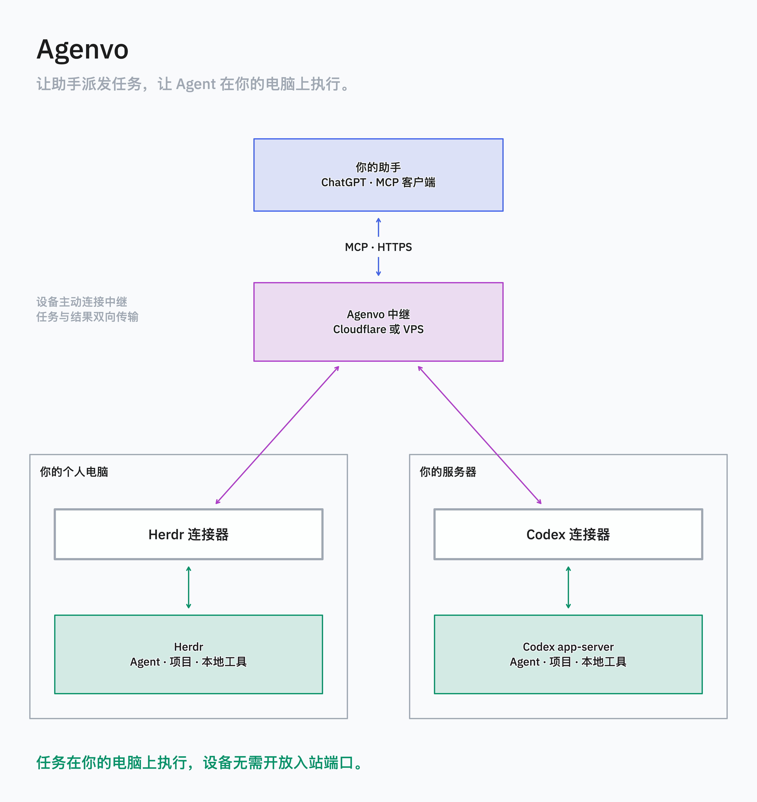

# Agenvo

[English](README.md)

让你的 AI 助手调度你自己电脑上的编程 Agent。

在手机上让 ChatGPT 查看服务器上 Codex 的进展，或让笔记本上 Herdr 里的 Agent 修复一个失败的测试。Agenvo 通过 MCP 将你的助手接入 **Herdr** 和 **Codex app-server**。你描述目标，助手自己判断如何推进工作。

中继由你自己部署在 Cloudflare 或单台 VPS 上。

## 如果你是 AI Agent

- 为用户安装 Agenvo，接入电脑和助手：[安装指南](docs/installation.zh-CN.md)。
- 排查连接或授权失败：[诊断说明](docs/usage.zh-CN.md#撤销与诊断)。
- 通过已有的 MCP 连接管理 Agent 工作：[Agent 管理](docs/management.zh-CN.md)。
- 理解或修改 Agenvo 的架构：[架构设计](design/architecture.zh-CN.md)。

## 许可证

[Apache-2.0](LICENSE)。
