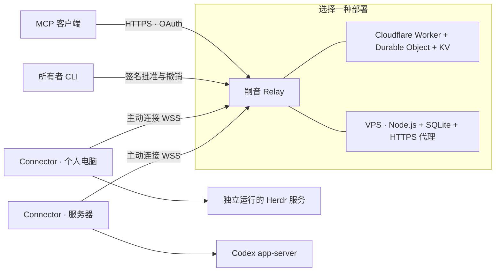

# 嗣音 · Siyin

[English](README.md)

嗣音把 MCP 客户端连接到你自己电脑上的编程运行时。持续可访问的 Relay 将请求转发到设备主动建立的连接，任务在设备上的原生 Herdr 或 Codex 环境中执行。

**状态：**早期版本，每个部署只支持一个所有者。适配器验证版本为 Herdr 0.9.3 和 Codex CLI 0.160.1。共享运行时前请阅读[安全边界](SECURITY.zh-CN.md)。



## 功能与边界

- 共享整个已批准的运行时实例，提供发现和原生方法 schema。
- 提供三个 MCP 工具：`instances_list`、`instance_describe` 和 `runtime_call`。
- 所有者核对指纹后配对设备；新增实例或权限范围变化需要批准。
- 保留原生任务 ID 和执行结果。调用被接受不代表任务已经完成。
- 设备断线后自动重连，但不会自动重放写操作。结果不确定时先查询原生状态。
- 连接独立运行的 Herdr；Connector 不启动或停止 Herdr session。

嗣音负责转发，不提供任务调度或 shell 沙箱。获准访问的 Herdr 实例可以用本机用户身份执行命令。同一部署中，所有有效 MCP 客户端均能访问全部已批准实例，包括将来批准的实例。

## 从源码开始

安装 Node.js **24.13 或更新版本**、npm，以及需要共享的运行时。Connector 支持 macOS 和 Linux；VPS 部署面向 Linux。

```sh
npm ci
npm run build
node dist/cli.js --help
```

下文中的 `siyin` 可以替换成 `node /absolute/path/to/siyin/dist/cli.js`，也可以用 `npm link` 安装本地 CLI。这些步骤不依赖已经发布的 npm 包。

1. 按 [Cloudflare 部署](docs/deployment-cloudflare.zh-CN.md)或[单 VPS 部署](docs/deployment-vps.zh-CN.md)建立 Relay。
2. 在每台电脑上[配置并配对 Connector](docs/usage.zh-CN.md)。
3. 在 MCP 客户端中添加 `https://YOUR_RELAY/mcp`，再批准 OAuth 请求。

| 部署 | 持久状态 | 所有者管理 | 运维方式 |
| --- | --- | --- | --- |
| Cloudflare | Durable Object SQLite、OAuth KV | 签名 CLI；可选 Access 保护的网页 | 托管 Worker、可休眠设备连接 |
| 单 VPS | 持久磁盘上的 SQLite | 签名 CLI | 单个 Node 进程、HTTPS 代理、备份 |

VPS 需要常驻 Node 进程；Cloudflare 不需要常驻容器。两种 Relay 均不运行编程 Agent。

## 文档

- [使用指南](docs/usage.zh-CN.md) · [English](docs/usage.md)
- [VPS 部署](docs/deployment-vps.zh-CN.md) · [English](docs/deployment-vps.md)
- [Cloudflare 部署](docs/deployment-cloudflare.zh-CN.md) · [English](docs/deployment-cloudflare.md)
- [安全边界](SECURITY.zh-CN.md) · [English](SECURITY.md)
- [贡献与测试](CONTRIBUTING.zh-CN.md) · [English](CONTRIBUTING.md)
- [架构与协议设计](docs/design/architecture.zh-CN.md)

## 许可证

[Apache-2.0](LICENSE)。
