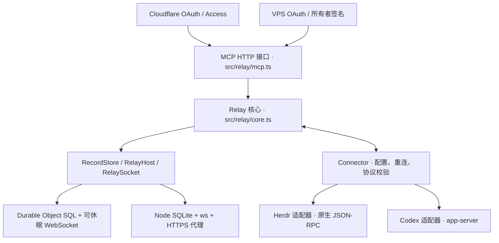

# Agenvo 架构与协议

Agenvo 将远程 MCP 请求送到用户批准的本地运行时。Relay 持有连接与访问授权，Connector 持有原生运行时连接，任务生命周期归 Herdr 或 Codex。首版支持单所有者、多个设备、Cloudflare 和单 VPS 两种部署。

本文描述当前实现。共同管理接口见[Agent 管理设计](agent-management.zh-CN.md)及[原生接口核对记录](agent-management-interface-audit.zh-CN.md)。

## 职责与实现

`src/relay/core.ts` 维护设备配对、实例指纹批准、授权、连接 epoch、并发限制、请求关联和结果交付。核心不依赖 Cloudflare 或 Node API。`src/relay/admin.ts` 共用签名管理端点的校验、撤销与错误语义；未知撤销目标返回 404，不报告成功。存储事务必须同步执行，不在事务内等待网络。

Cloudflare 的 `src/relay/relay.ts` 实现 Durable Object 宿主与 RPC 边界，保留原有 SQLite records 表；`worker.ts` 提供 HTTP、OAuth 和可选 Access 网页。VPS 的 `src/server` 实现 Node HTTP/WebSocket、SQLite 和 MCP SDK OAuth Provider。两种 OAuth 实现使用平台各自支持的存储与协议库，共用 Relay 授权检查和 MCP 接口。没有为统一库接口而在 VPS 模拟 Cloudflare 运行时。

VPS 只有一个进程持有数据库排他锁。状态目录属于运行用户且权限 0700，数据库为 0600。公网 HTTPS 可以由代理或 Node TLS 提供；内部 HTTP 不构成公网明文支持。两种部署间没有自动迁移，切换需要新的设备配对和客户端授权。

## 连接与权限

设备以本地产生的秘密进行配对。Relay 只保存摘要；所有者根据设备终端指纹批准设备及其初始实例。设备主动建立 WSS，认证成功后获得新的 epoch，同设备旧连接失效。实例 hello 包含范围指纹；新增或变更范围在再次批准前不能调用。

所有者 CLI 用本机 ES256 私钥签署绑定 origin、HTTP 方法、路径、请求体摘要和最长 60 秒声明有效期、五秒时钟容差的请求。Relay 只持公钥。OAuth consent 另有签名用途域，防止跨接口复用。Cloudflare 网页还验证 Access JWT 与 CSRF；VPS 只提供 CLI 所有者管理。

MCP 客户端通过动态注册和 S256 PKCE 授权码流程取得令牌。访问令牌 15 分钟，授权最长 30 天。VPS 将授权码、访问令牌、刷新令牌的摘要持久化；刷新令牌只用一次，重用撤销对应授权。原始令牌不进入日志。设备、实例和客户端授权均可独立撤销。

授权覆盖同一部署所有已批准实例及之后批准的实例。没有租户隔离或逐客户端实例 ACL。拥有 Herdr 访问权意味着能以设备用户身份执行命令；实例目录不是安全沙箱。受信客户端必须与用户本人具有相称权限。

## 执行语义与故障

MCP 只暴露 `instances_list`、`instance_describe`、`runtime_call`，由实例声明共同的 management.* 方法与具体原生方法。共同管理单位是 Thread，`management.threads.observe` 返回该会话的状态、事件和待回应请求；不提供独立 Run 对象。没有通用任务状态库，也不把终端 idle 映射为业务任务成功。

| execution | 语义 | 调用方动作 |
| --- | --- | --- |
| not_started | 已知尚未派发 | 修正条件后可重新发起 |
| starting | 适配器已开始异步原生操作，并提供查询标识 | 查询原生状态 |
| accepted | 原生端确认接受 | 使用原生 ID 观察任务 |
| rejected | 原生端明确拒绝 | 检查拒绝原因 |
| unknown | 无法确认操作是否已经执行 | 查询原生状态，禁止盲目重复写操作 |

单次 Relay 调用最多十秒。断线、重启、超时不会自动重放写操作，也不意味着原生任务取消。epoch 防止旧连接结果串入新连接。结果交付前再次检查授权与指纹，撤销后不交付在途结果，但不强行停止已经执行的任务。Connector 断线自动重连，运行时任务继续独立存在。

传输帧正常上限 64 KiB，解析硬上限 1 MiB；实例和查询结果分页。全局在途请求最多 64、每设备 16；设备最多 32、实例最多 128。VPS OAuth 动态客户端注册和授权码数量有界。未批准的 OAuth 注册一小时后回收，已过期的 confidential client secret 对应注册自动清理。限制用于个人部署的资源保护，不承诺抵御大规模网络攻击。

Herdr 适配器连接独立的原生服务，不提供 session.start/stop。原生 workspace、agent、pane 的操作属于用户已批准的运行时能力。Codex 托管模式使用独立 HOME；attach-unix 实验模式连接已有控制端点，不启停桌面 App。两种模式的创建、恢复和输入均应用 full access，关闭沙箱与执行审批；原生权限请求自动回答。用户问题和动态工具调用仍需回答内容。

## 验证边界

持续回归包括协议、执行配置和管理契约单元测试、原生输入与审批 fixture、实际 workerd 绑定测试，以及实际 Node HTTP/OAuth/MCP/WebSocket 与 SQLite 重启测试。原生适配器测试另需安装已验证版本的 Herdr/Codex；不能用 fixture 结果声称特定客户端或云账号已通过生产验收。

Docker 构建用于检查 Linux 分发产物，真实公网证书、DNS、Cloudflare Access 策略和各 MCP 客户端登录仍由部署者在自己的环境验收。CI 不连接维护者的个人运行时、账号或生产 Relay。

## 改名与兼容标识

Agenvo 延续嗣音的协议版本 1。CLI、文案及新安装默认值采用新名称；线上协议字符串、所有者签名用途域、Durable Object 类名和 VPS 数据库文件名保持不变，避免将品牌调整变成协议或数据迁移。旧 `SIYIN_CONFIG_DIR` 仅作为显式配置的后备入口，新变量优先；不自动扫描或搬移旧目录。部署者按[迁移说明](../migration.zh-CN.md)切换服务，仓库改名不触发生产升级。

管理引用绑定适配器生命周期，观察记录在 Connector 内存中有界保存；淘汰和原生连接变化显式报告 gap。Relay 不保存另一套任务状态，继续使用有限 JSON 响应和既有协议 1。
